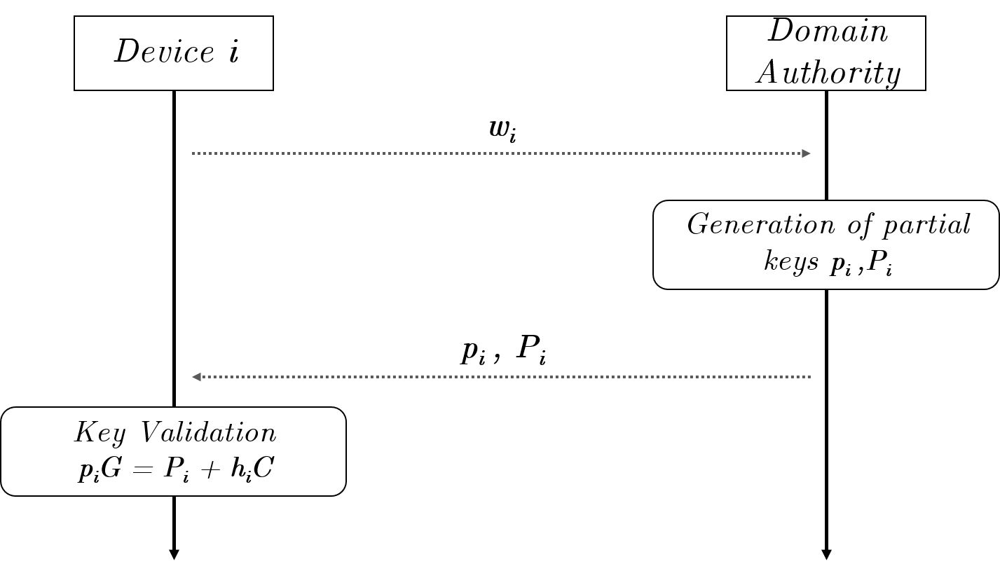
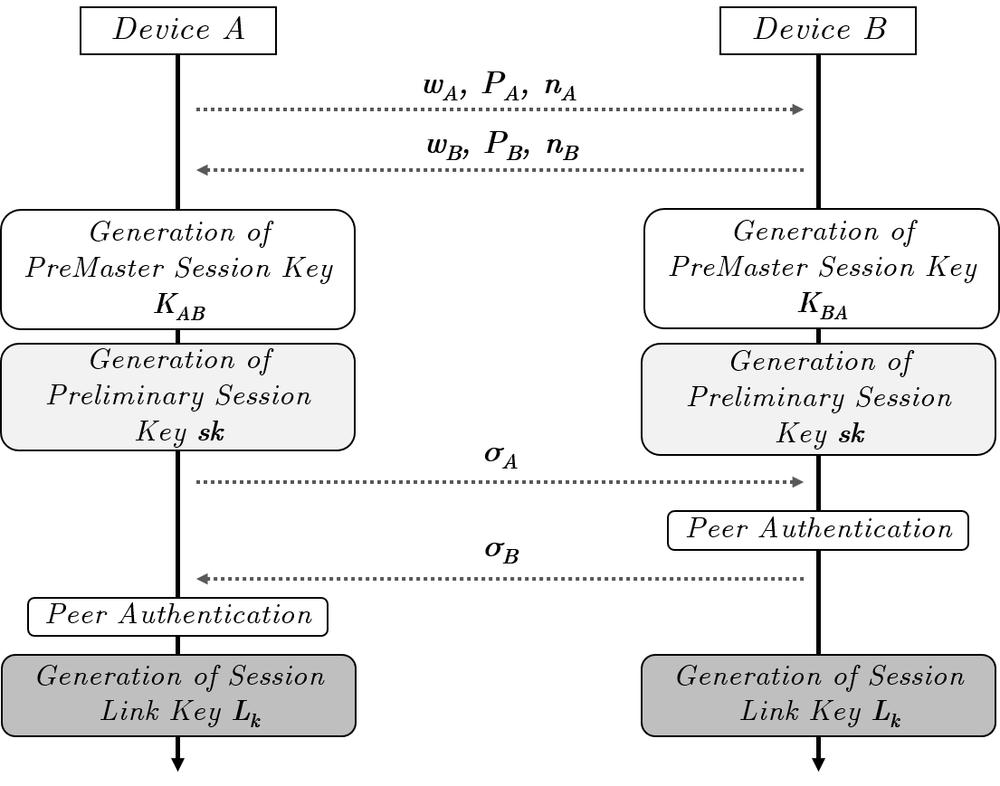
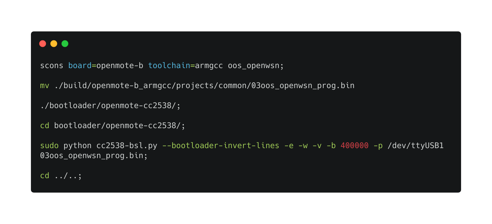
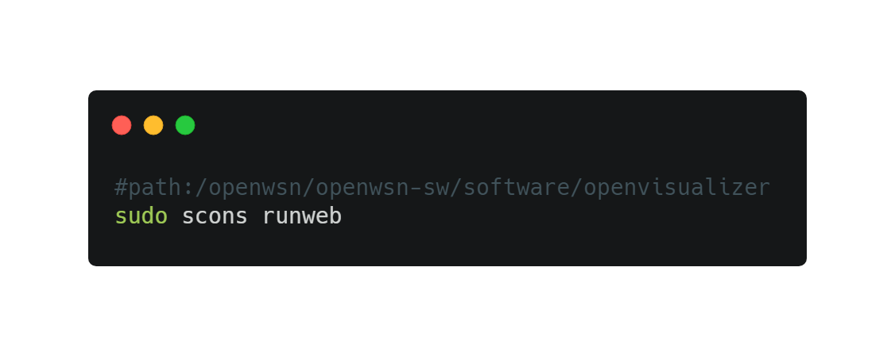
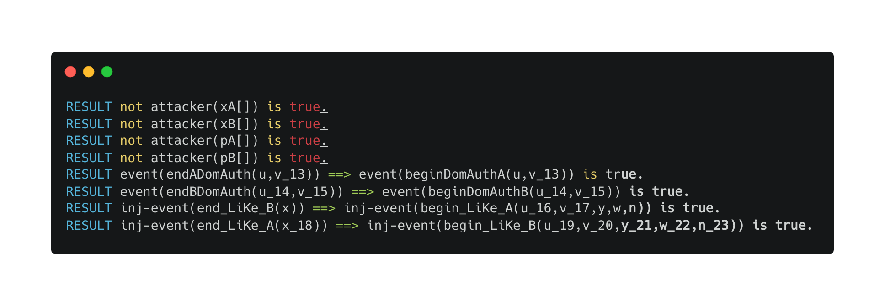

# LiKe - IoT Certificateless Key Agreement Protocol
<p align="center">
     
     
     
     
</p>

LiKe is a lightweight pairing-free certificateless key agreement protocol suitable for integration in communications between IoT devices. It is developed for the standardized <a href="https://openwsn.atlassian.net/wiki/spaces/OW/overview">OpenWSN</a> protocol stack, IEEE 802.15.4e, for <a href="http://www.openmote.com/">OpenMote-b</a> devices.

## How it works
Without loss of generality, we assume that some cryptographic elements are pre-configured in each device by the network administrator before the physical deployment.

In the pre-deployment phase, each device participating in the system interacts securely with the Domain Authority, to receive dedicated cryptography elements. The flow of the interactions between the Domain Authority and a generic device *i* is depicted in the following Figure.

<p align="center">
     
</p>

The rationale of the LiKe scheme consists in the exchange of four different logical messages, two per each involved device.
* The first two messages, one per participating device, are dedicated to the exchange of the cryptography materials necessary for an entity to generate the public key of the remote device.
* The received public key is then used to generate a shared secret, according to the well-known Elliptic Curve Diffie Hellman (ECDH) scheme.
* The latter two messages, instead, allow any of the two entity to verify the authenticity of the remote party and to establish a unique session key, that will be used to protect messages delivered on the wireless communication channel.

The flow of the interactions between a generic device *A* and a generic device *B* is depicted in the following Figure.

<p align="center">
     
</p>

* *For further details, please refer to the paper.*

## How to compile the code

<p align="center">
  
</p>

In order to find your USB serial port, you can list the USB ports by running `ls /dev/ttyUSB*`. For OpenMote-b devices, please specify the odd port to write the firmware (e.g. `ttyUSB1, ttyUSB3, ...`.

## Network Protocol Configuration

IoT devices and network configuration can be configured by modifying the main protocol files `keyneg.c` and `keyneg.h` in `/openwsn/openwsn-fw/openstack/02b-MAChigh/`.

In file `keyneg.c`, you can configure the topology and the respective public keys as following:
```c
switch (idmanager_getMyID(ADDR_64B)->addr_64b[7])
    {
    case TOPOLOGY_ROOT:
        //Device ID A
        negkey_vars.id[0] = 0xca;
        negkey_vars.id[1] = 0xfe;

        //Device Timestamp
        negkey_vars.ts[0] = 0x00;
        ...
        negkey_vars.ts[9] = 0x00;

        // First Partial Private Key xA
        memset(negkey_vars.myFirstKey.Private, 0, 4 * CURVE_LEN);
        negkey_vars.myFirstKey.Private[0] = 0x11111111;
        ...
        negkey_vars.myFirstKey.Private[4] = 0x33333333;

        negkey_vars.myFirstKey.Public = &negkey_vars.my_FirstPublicKey;
        negkey_vars.myFirstKey.Public->pui32X = negkey_vars.my_FirstPublicKey_X;
        negkey_vars.myFirstKey.Public->pui32Y = negkey_vars.my_FirstPublicKey_Y;

        // First Partial Public Key (XA.x)
        negkey_vars.my_FirstPublicKey_X[0] = 0x9a201026;
        ...
        negkey_vars.my_FirstPublicKey_X[4] = 0x7db98969;

        // First Partial Public Key (XA.y)
        negkey_vars.my_FirstPublicKey_Y[0] = 0x1946898c;
        ...
        negkey_vars.my_FirstPublicKey_Y[4] = 0xb9482924;

        // Random value ri chosen by the Domain Authority
        memset(negkey_vars.myr.Private, 0, 4 * CURVE_LEN);
        negkey_vars.myr.Private[0] = 0x11111111;
        ...
        negkey_vars.myr.Private[4] = 0x44444444;

        // Pi = ri*G
        negkey_vars.myr.Public = &negkey_vars.my_SecondPublicKey;
        negkey_vars.myr.Public->pui32X = negkey_vars.my_SecondPublicKey_X;
        negkey_vars.myr.Public->pui32Y = negkey_vars.my_SecondPublicKey_Y;

        // Second Partial Public Key (PA.x)
        negkey_vars.my_SecondPublicKey_X[0] = 0x6967ac88;
        ...
        negkey_vars.my_SecondPublicKey_X[4] = 0x7fae383b;

        // Second Partial Public Key (PA.y)
        negkey_vars.my_SecondPublicKey_Y[0] = 0xbbc17628;
        ...
        negkey_vars.my_SecondPublicKey_Y[4] = 0x2e008074;
  }
```
Public keys and private keys of devices and Domain Authority, are configured as static (it is the setup phase).

* **id**: define the custom ID of the IoT node. It could be a value starting from `0x00` to `0xff`.
* **timestamp**: a value that is configured during the setup phase. It establish the validity of the partial public key delivered by the authority. By default, the timestamp is set to 0.

## Security Level Configuration

`LiKe` supports the following security levels:
* 80 bits      -    *secp160r1*
* 96 bits      -    *secp192r1*
* 128 bits     -    *secp256r1*

It is possible configure the security level as well as the elliptic curve in the `keyneg.c` and `keyneg.h` files as follows.
For example, if we want to configure the security level to 80 bits, we need to specify the parameters of the respective elliptic curve (e.g. *secp160r1*) in the file `keyneg.h` as:
```c
#define CURVE_LEN 5 //6//8

//=========================== typedef =======================================
static uint32_t nist_p_160_p[5] = {0x7fffffff, 0xffffffff, 0xffffffff, 0xffffffff,
                                   0xffffffff};
static uint32_t nist_p_160_n[6] = {0xca752257, 0xf927aed3, 0x0001f4c8, 0x00000000,
                                   0x00000000, 0x00000001};
static uint32_t nist_p_160_a[5] = {0x7ffffffc, 0xffffffff, 0xffffffff, 0xffffffff,
                                   0xffffffff};
static uint32_t nist_p_160_b[5] = {0xc565fa45,0x81d4d4ad,0x65acf89f,0x54bd7a8b,
                                    0x1c97befc,};
static uint32_t nist_p_160_x[5] = {0x13cbfc82, 0x68c38bb9, 0x46646989, 0x8ef57328,
                                   0x4a96b568};
static uint32_t nist_p_160_y[5] = {0x7ac5fb32, 0x04235137, 0x59dcc912, 0x3168947d,
                                   0x23a62855};
```

Finally, for the elliptic curve parameters initialiazion, you need to put the following definitions in `keyneg.c`:
```c
    //Elliptic curve initialization
    negkey_vars.nist_p_160_my.pui32A = &nist_p_160_a;    // a coefficient on the curve
    negkey_vars.nist_p_160_my.pui32B = &nist_p_160_b;    // b coefficient on the curve
    negkey_vars.nist_p_160_my.pui32Gx = &nist_p_160_x;   // x coefficient on the generator point G for the curve
    negkey_vars.nist_p_160_my.pui32Gy = &nist_p_160_y;   // y coefficient on the generator point G for the curve
    negkey_vars.nist_p_160_my.pui32N = &nist_p_160_n;    // order of the cyclic group #E(Zp)
    negkey_vars.nist_p_160_my.pui32Prime = &nist_p_160_p; // prime number p of the curve
    negkey_vars.nist_p_160_my.ui8Size = 5;                // size of the words for secp160r1
    
    negkey_vars.curve_info = &negkey_vars.nist_p_160_my;
```

## How to Run the Protocol
1. In order to run/test the protocol, you need to run the OpenVisualizer software from the path: `/openwsn/openwsn-sw/software/openvisualizer` and execute `sudo scons runweb`.

<p align="center">
  
</p>

2. Open your browser and open the following URL <a href="http://127.0.0.1:8080">http://127.0.0.1:8080</a>, choose one of your nodes, and sets it as root by pressing the button `Toggle DAG Root`.

3. In your terminal you will see that both the devices will agree on same shared secret key. During the key agreement, if the key is not valid, please try to restart the child node.

## Formal verification with ProVerif
The security properties of `LiKe` have been verified formally and experimentally by using the open-source tool <a href="https://prosecco.gforge.inria.fr/personal/bblanche/proverif/">ProVerif</a>, demonstrating enhanced security protection with respect to state-of-the-art approaches.

In order to test the security properties, download the file <a href="kmp.pv">kmp.pv</a> and run: `proverif kmp.pv | grep "RESULT"`:

<p align="center">
  
</p>

## Contributing
Pull requests are welcome. For major changes, please open an issue first to discuss what you would like to change.

## License
`LiKe` is released under the GPL 3 <a href="LICENSE">license</a>.
